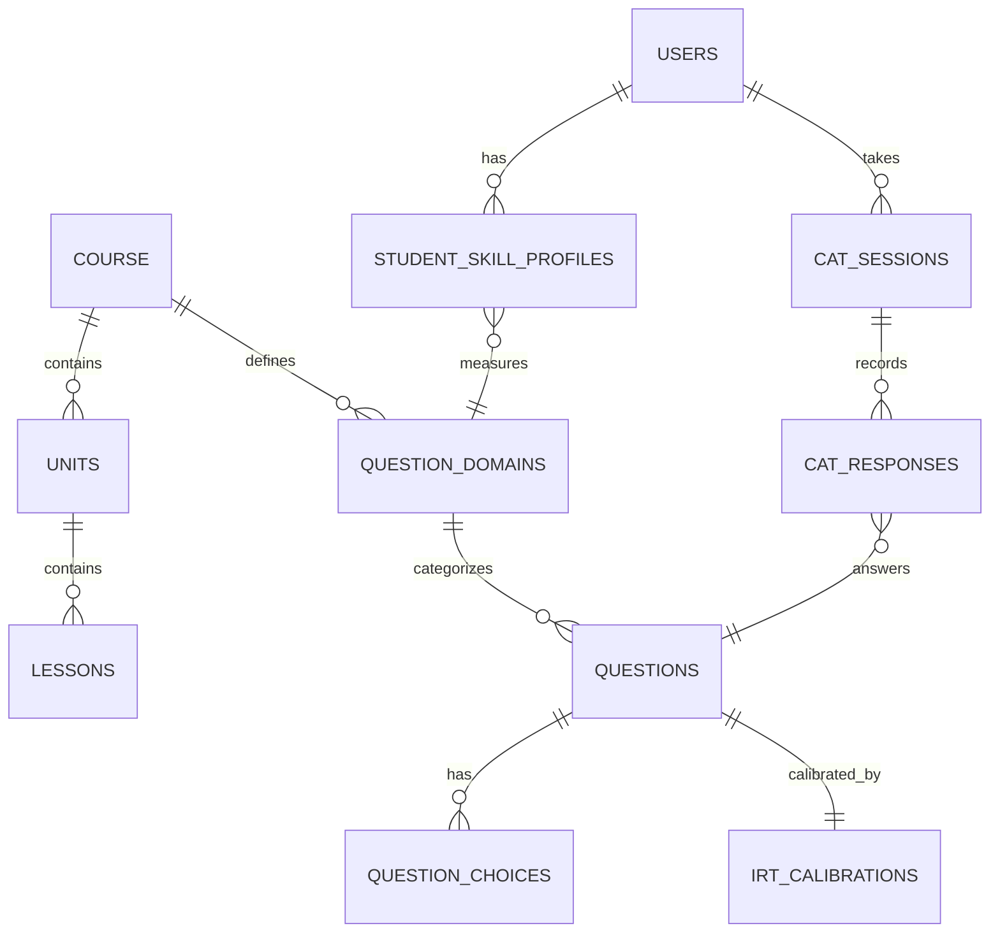

# Database Schema (PostgreSQL)

## 1. Overview
ออกแบบฐานข้อมูลสำหรับรองรับ IRT 3PL และ CAT อย่างเต็มรูปแบบ โดยใช้ Supabase (PostgreSQL) เป็นหลัก

## 2. Table Definitions (Core Tables)

### Users & Roles
*   **`users`**: id, email, role, created_at, updated_at
*   **`roles`**: id, name (student, teacher, admin)

### Course Structure
*   **`courses`**: id, title, description
*   **`units`**: id, course_id, sequence, title
*   **`lessons`**: id, unit_id, sequence, content, type (theory, code_lab)
*   **`question_domains`**: id, name (D1-D5), description

### Item Bank (Questions)
*   **`questions`**: id, question_id, course_id, domain_id, sub_domain, question_text, question_type, cognitive_level, correct_answer, status (DRAFT -> ACTIVE)
*   **`question_choices`**: id, question_id, choice_text, is_correct
*   **`irt_parameters`** (รวมใน `questions` หรือแยกก็ได้): a_parameter, b_parameter, c_parameter, scale_constant (default 1.7)
*   **`irt_calibrations`**: id, question_id, calibration_status, sample_size, parameter_se_a, parameter_se_b, parameter_se_c
*   **`item_usage`**: question_id, exposure_count, exposure_rate

### CAT Sessions & Responses
*   **`cat_sessions`**: id, session_id, student_id, test_id, initial_theta, current_theta, standard_error, estimation_method, items_answered, status (ACTIVE, COMPLETED), started_at, completed_at
*   **`cat_responses`**: id, session_id, question_id, student_id, sequence, answer, is_correct, response_time, theta_before, theta_after, item_information, standard_error_after, created_at

### Learning Profile
*   **`student_skill_profiles`**: id, student_id, domain_id, theta, standard_error, information, mastery_level, strength_status, weakness_status, last_assessment_id, updated_at
*   **`recommendations`**: id, student_id, recommended_type (lesson, exercise), reference_id, reasoning (จาก AI), status

## 3. Entity Relationship Diagram (ERD)

