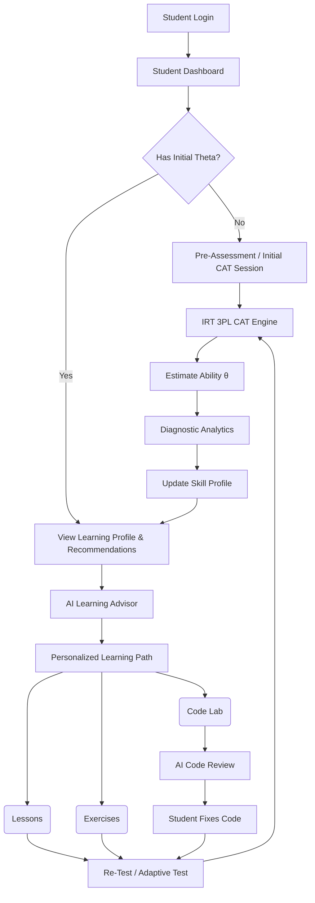

# System Architecture

## 1. Overview
**WebAI Adaptive Learning Platform** เป็นระบบเรียนรู้แบบปรับเหมาะสำหรับวิชา "การสร้างเว็บไซต์" (ระดับ ปวช.) โดยอาศัยเทคโนโลยี **Computerized Adaptive Testing (CAT)** บนฐานคณิตศาสตร์ **Item Response Theory 3-Parameter Logistic Model (IRT 3PL)** ร่วมกับเทคโนโลยี **Generative AI** 

## 2. Technology Stack
*   **Frontend**: ReactJS, Next.js (App Router), Tailwind CSS v4, Lucide Icons
*   **Backend**: Node.js (Next.js Route Handlers / Server Actions), TypeScript
*   **Database & Authentication**: Supabase (PostgreSQL, Supabase Auth)
*   **AI Engine**: Google Gemini API (Server-side เท่านั้น)
*   **Deployment**: Vercel (Frontend & Serverless Functions), Supabase Cloud (Database)
*   **Code Lab Sandbox**: Web-based Secure Iframe (`sandbox="allow-scripts"`) หรือ Web Worker + WebContainers สำหรับแยกสภาพแวดล้อมการทำงานของโค้ดนักเรียนออกจาก Server หลัก

## 3. Architecture Layers

### 3.1 Presentation Layer (Frontend)
*   **Student UI**: Dashboard, Adaptive Test Interface, Code Lab, Learning Profile
*   **Teacher UI**: Class Analytics, Item Analysis, Dashboard
*   **Admin UI**: User & Role Management, Audit Logs

### 3.2 Application Layer (Backend / Server)
*   **Auth Service**: RBAC (Role-Based Access Control)
*   **Course Service**: จัดการโครงสร้าง D1-D5, บทเรียน
*   **IRT & CAT Engine**: 
    *   **IRT Service**: คำนวณสมการ 3PL, Item Information, Ability Estimation (MLE/MAP/EAP)
    *   **CAT Service**: ควบคุม Session, Item Selection (MFI), Stopping Rules, Content Balancing
*   **AI Service**: 
    *   AI Tutor (ตอบคำถาม/แนะแนว)
    *   AI Code Review (ตรวจ Syntax/Structure)
    *   AI Learning Advisor (สังเคราะห์ Skill Gap เป็น Recommendation)

### 3.3 Data Layer (Database)
*   **Supabase PostgreSQL**: จัดเก็บข้อมูลผู้ใช้, ข้อสอบ (a, b, c parameters), ประวัติการทำข้อสอบ (CAT Responses), และ Learning Profiles

## 4. System Flow

## 5. Migration & Safety Strategy (จากข้อกำหนด)
*   **Safety First**: แยก Module ของ CAT Engine และ IRT ออกจากโฟลเดอร์ Application เดิม (เช่น ไว้ใน `src/modules/irt/`) เพื่อป้องกันผลกระทบกับระบบที่กำลังทำงานอยู่
*   **Supabase Persistence**: ใช้ Supabase เป็นฐานข้อมูลหลักเช่นเดิมตามที่ได้รับอนุมัติ 
